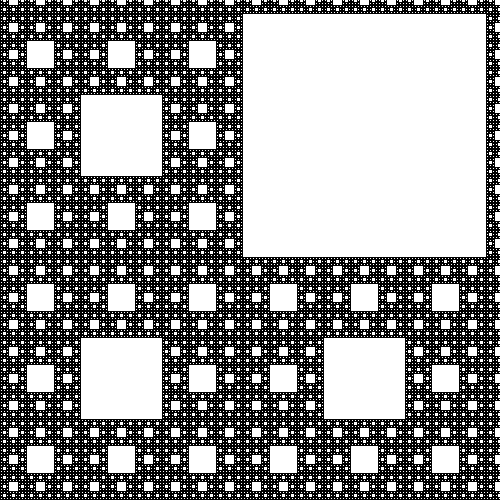
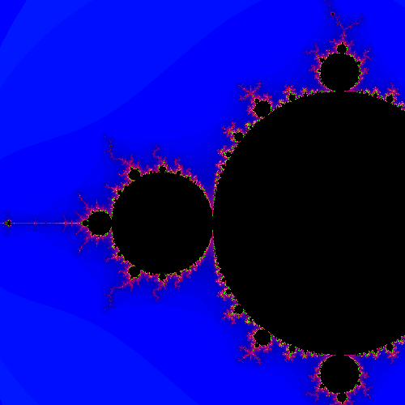
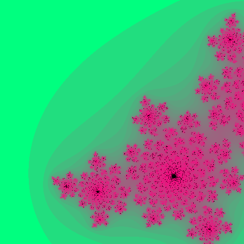
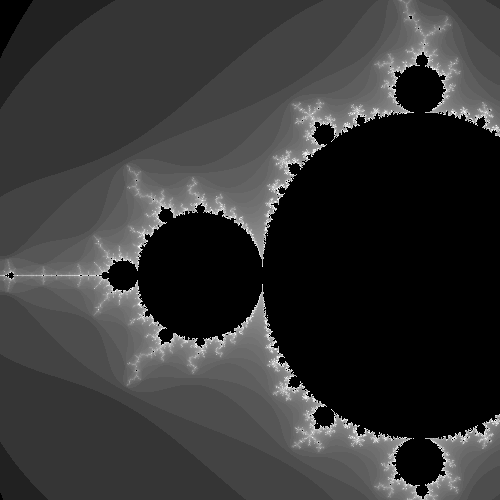
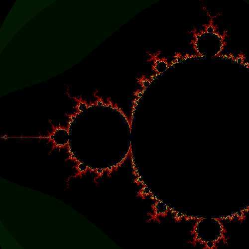
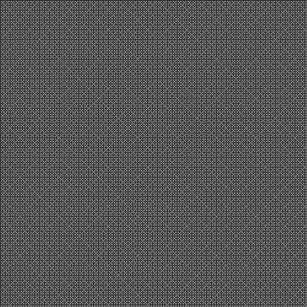
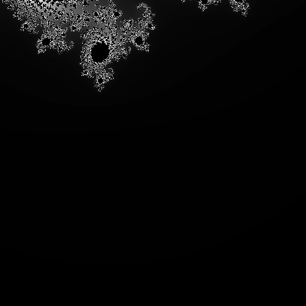

# highCL-examples
This is repo for examples of [highCL](https://github.com/opencl-pure/highCL)
# fill_image_fractals
|                                      |                                |                |                       |
| :----------------------------------: | :----------------------------: | :------------: | :-------------------: |
|    
||||
                                                                                 | 
||| |
